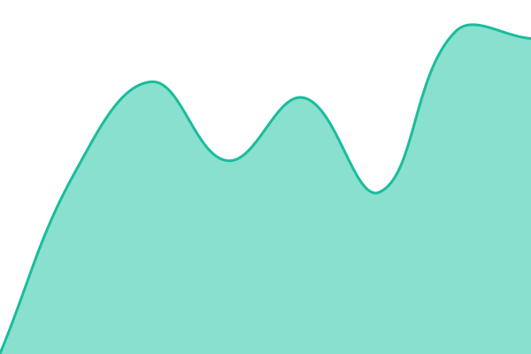

# [📈 Live Status](https://nca-apprentices.github.io/status): <!--live status--> **🟩 All systems operational**

This repository contains the open-source uptime monitor and status page for [nca-apprentices](https://nca-apprentices.github.io/status), powered by [Upptime](https://github.com/upptime/upptime).

With [Upptime](https://upptime.js.org), you can get your own unlimited and free uptime monitor and status page, powered entirely by a GitHub repository. We use [Issues](https://github.com/nca-apprentices/status/issues) as incident reports, [Actions](https://github.com/nca-apprentices/status/actions) as uptime monitors, and [Pages](https://nca-apprentices.github.io/status) for the status page.

<!--start: status pages-->
<!-- This summary is generated by Upptime (https://github.com/upptime/upptime) -->
<!-- Do not edit this manually, your changes will be overwritten -->
<!-- prettier-ignore -->
| URL | Status | History | Response Time | Uptime |
| --- | ------ | ------- | ------------- | ------ |
|  [ncaleague](https://ncaleague.nca-apprentices.dev) | 🟩 Up | [ncaleague.yml](https://github.com/nca-apprentices/status/commits/HEAD/history/ncaleague.yml) | 

 396ms
     
 | 

<a href="https://status.nca-apprentices.dev/history/ncaleague">100.00%</a>
    

|  [jjforge](https://jjforge.nca-apprentices.dev) | 🟩 Up | [jjforge.yml](https://github.com/nca-apprentices/status/commits/HEAD/history/jjforge.yml) | 

 622ms
     
 | 

<a href="https://status.nca-apprentices.dev/history/jjforge">100.00%</a>
    

|  [Ops portal](https://ops.nca-apprentices.dev) | 🟩 Up | [ops-portal.yml](https://github.com/nca-apprentices/status/commits/HEAD/history/ops-portal.yml) | 

 639ms
     
 | 

<a href="https://status.nca-apprentices.dev/history/ops-portal">100.00%</a>
    

<!--end: status pages-->

[**Visit our status website →**](https://nca-apprentices.github.io/status)

## 📄 License

- Powered by: [Upptime](https://github.com/upptime/upptime)
- Code: [MIT](./LICENSE) © [Anand Chowdhary](https://anandchowdhary.com)
- Data in the `./history` directory: [Open Database License](https://opendatacommons.org/licenses/odbl/1-0/)
